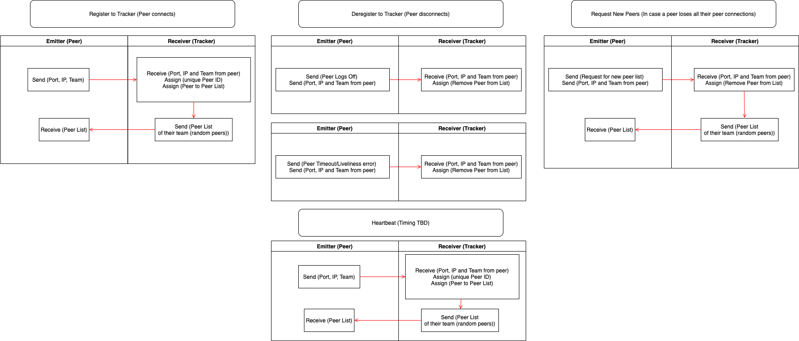
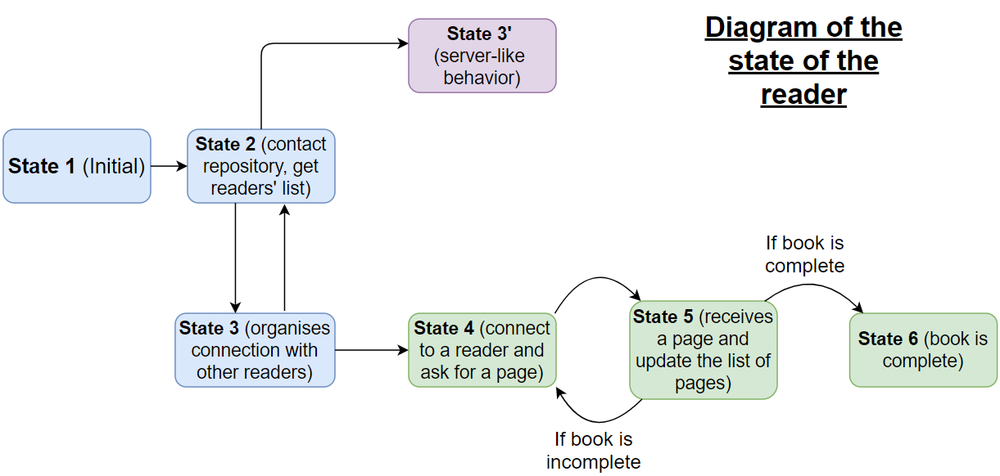

## Protocol

### I. Descrifier 
  * takes a file (input),
  * write address of the repository, name and size of the file and the size of each piece on the description file
  * compute and write SHA1 for each piece 
  * return the description file (.desc)

##### library *hashlib* to compute the SHA1
```
for each piece :
    code = hashlib.sha1()
    code.update(piece)
    descFile.write(code.hexdigest)
```
### II. Repository
  * **Reader Registers (Peer Connects)**  
      Reader → Repository  
      - Send (Port, IP, Team)  
      - Receive (Port, IP, Team [from Peer])  
      - Assign (unique Peer ID)  
      - Assign (Peer to Peer List)  
      
     Repository → Reader  
      - Send (Peer List of their team (random peers))  
      - Receive (Peer List)  

  * **Reader Deregisters (Peer Disconnects)**  
      Reader → Repository  
        - Send (Peer Logs Off)  
        - Send (Port, IP and Team from peer)  
        - Receive (Port, IP and Team from peer)  
        - Assign (Remove Peer from List)  
  
  * **Reader Deregisters (Peer Fails "Livelihood" Test)**  
      Reader → Repository  
        - Send (Error/Timeout) 
        - Send (Port, IP and Team from peer)  
        - Receive (Port, IP and Team from peer)  
        - Assign (Remove Peer from List)  

  * **Heartbeat**  
      Reader → Repository  
        - Send (Port, IP, Team)  
        - Receive (Port, IP and Team from peer)  
        - Assign (unique Peer ID)  
        - Assign (Peer to Peer List)  
        
      Repository → Reader  
         - Send (Peer List of their team (random peers))  
         - Receive (Peer List)  

  * **Request New Readers (In case all Readers for a Peer disconnect)**  
      Reader → Repository  
        - Send (Request for new peer list)   
        - Send (Port, IP and Team from peer)  
        - Receive (Port, IP and Team from peer)    
        - Assign (Remove Peer from List)  
            
       Repository → Reader  
        - Send (Peer List of their team (random peers))  
        - Receive (Peer List)  



### III. Reader

##### State 1 (initial)   
  * Download description on hard drive  
  * Load book if owned   
  * Create list of owned pages and their validity (SHA1) (type : list)  
  * Switch to state 2  

##### State 2 (contacts repository, get readers list)  
  * Start new thread for the server and switch to State 3' in it *Warning (should be done only once !)*  
  * if timeout :  
      * begin timer
      * Connection to repository and request list of readers (type : list) (heartbeat)
      * Wait for the list of other readers
  * Switch to state 3

##### State 3 (organises connection with other readers)  
  (for each connection with an other reader)  
  * Begin queue ??  
  * Start a new thread  
  * (new thread) Connect to an other reader  
  * (new thread) If failure : send message of error to repository to trigger the “liveliness” test and close thread  
  * (new thread) Else :  
    * send the list of pages the reader has   
    * wait for the list of the other reader  
    * switch to State 4  
  * (main thread) Switch to State 2  

##### State 4 (connects to a reader and ask for a page)  
  (in the principal thread (daemon))  
  * if timeout (periodically) request other reader's list  
  * if request lists : eventually do in the separate thread, otherwise wait for lists then begin timer  
  * compare the lists of pages  
  * ask by order of rarity and to balance the number of package by readers, we can also ask for a page the other peer does not have if all his pages are already owned  
  * Switch to State 5  

##### State 5 (receives a page and update the list of pages)   
  * wait for the reception  
  * if error message (check case timeout, who deal with it, application or tcp ?? )  
  * check the SHA1   
  * update the owned list of pages  
  * If list is incomplete Switch to State 4   
  * Else switch to State 6  

##### State 6 (book is complete)   
  * close the connections for all readers  
        
#####  State 3' (Server-like behavior)   
  * Wait for a request  
  * if $ask\_list$, send the list  
  * if $ask\_page(i)$ send page if available  
    else start a new thread as in state 3 and 4 to ask for the missing page  


